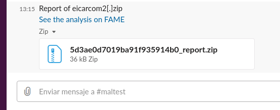
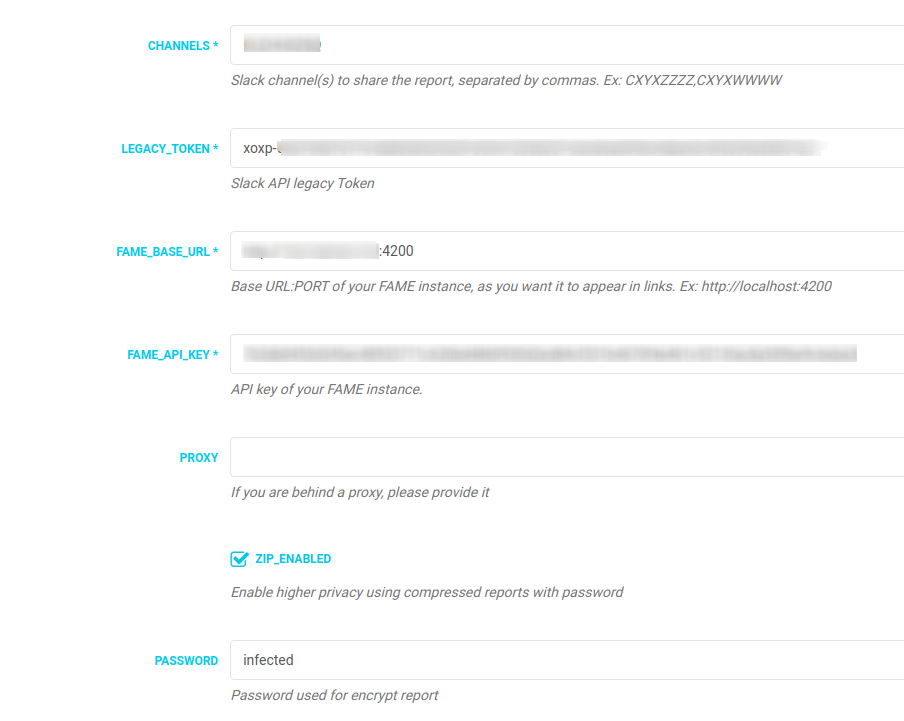

# SlackReport WK

This module send a full PDF report with images of the last analysis to the selected Slack channel. Useful if you have isolated teams with no access to the malware lab.



## Features

- Full PDF report from FAME with original images and styles.
- Privacy in communications via compressed reports with password.

## Requirements

- Requests library
- FAME API key
- Latest patched version of wkhtmltopdf (0.12.5 or higher):
https://wkhtmltopdf.org
```
Ex: for Ubuntu 18 (bionic)
wget https://github.com/wkhtmltopdf/wkhtmltopdf/releases/download/0.12.5/wkhtmltox_0.12.5-1.bionic_amd64.deb
$ sudo apt install ./wkhtmltox_0.12.5-1.bionic_amd64.deb
```
- 7z for compressed reports (allready installed with FAME). If not use:
```
sudo apt-get install p7zip-full
```
- Slack legacy token API: https://api.slack.com/custom-integrations/legacy-tokens
- Slack channel ID to use. From slack URL:
```
 https://app.slack.com/client/<team>/<channel_ID>
 -or-
 https://<slackteam>.slack.com/messages/<channel_ID>
```

## PROBLEMS?

- Always use latest pip version:
```
sudo pip install --upgrade pip
```
- If you are behind a proxy, configure /etc/environment and add your FAME IP to "no_proxy"

```
http_proxy="http://PROXY:PORT"
HTTP_PROXY="http://PROXY:PORT"
https_proxy="https://PROXY:PORT"
HTTPS_PROXY="https://PROXY:PORT"
no_proxy="localhost,127.0.0.1,FAME_IP"

```

## Configuration

- Example configuration



## TODO

- Preliminary proxy support.